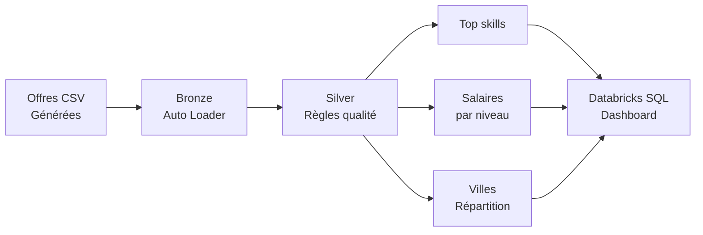

# 💼 Tech Jobs Market — Pipeline déclaratif sur Databricks (Lakeflow Declarative Pipelines)

Pipeline de données construit avec **Lakeflow Declarative Pipelines** (anciennement Delta Live Tables / DLT), appliqué à des offres d'emploi tech, pour explorer l'approche déclarative de Databricks — en complément d'un premier projet construit en PySpark impératif classique.

## Contexte

Après un premier projet ([BIXI Montréal](../bixi-mobility-databricks-pipeline)) construit en PySpark classique (lecture, transformation, écriture et orchestration gérées manuellement), ce second projet explore une approche différente : la **déclarativité**. Plutôt que d'écrire chaque étape du pipeline, on décrit simplement le résultat attendu de chaque table, et Databricks se charge de l'ordre d'exécution, des dépendances, du suivi incrémental et de la qualité des données.

Objectif : couvrir un maximum de facettes de l'outil Databricks, dans une logique de préparation à la certification **Databricks Data Engineer Associate**.

Le jeu de données (offres d'emploi tech : intitulé, entreprise, ville, contrat, compétences, salaire) a été **généré synthétiquement** plutôt que téléchargé, pour garder un contrôle total sur les données et illustrer volontairement des cas invalides (utiles pour tester les règles de qualité).

## Architecture

## Stack technique

| Composant | Technologie |
|---|---|
| Pipeline | Lakeflow Declarative Pipelines (ex-Delta Live Tables) |
| Ingestion | Auto Loader (`cloudFiles`), déclaré via `@dp.table` |
| Qualité des données | `@dp.expect` / `@dp.expect_or_drop` |
| Stockage | Delta Lake |
| Gouvernance | Unity Catalog |
| Restitution | Databricks SQL Dashboard |
| Langage | Python (PySpark), SQL |

## Ce que fait chaque couche

**Bronze — `jobs_bronze`**
Ingestion incrémentale des fichiers CSV via Auto Loader, déclarée en une seule fonction décorée `@dp.table` — sans gestion manuelle de checkpoint ni de trigger.

**Silver — `jobs_silver`**
Nettoyage avec règles de qualité intégrées au code :
- `expect_or_drop` : rejette les lignes sans salaire renseigné ou avec un salaire max inférieur au salaire min
- `expect` : signale (sans les supprimer) les lignes sans ville renseignée

Les compétences (stockées en une chaîne séparée par `;`) sont également éclatées en une ligne par compétence via `explode`.

**Gold — 3 vues matérialisées**
- `top_skills` : classement des compétences les plus demandées
- `salary_by_level` : salaire moyen (min/max) par niveau d'expérience
- `jobs_by_city` : répartition des offres par ville et part de télétravail

## Ce que l'approche déclarative change concrètement

| | PySpark classique (projet BIXI) | Lakeflow Declarative Pipelines (ce projet) |
|---|---|---|
| Orchestration | Configurée manuellement (Databricks Workflow) | Déduite automatiquement des dépendances entre tables |
| Checkpoint / trigger | Gérés à la main dans le code | Pris en charge automatiquement |
| Qualité des données | Filtres `.filter()` manuels | Règles déclaratives (`@dp.expect`) avec métriques natives |
| Visualisation du pipeline | Graphe reconstitué via le Workflow | Graphe de lineage généré automatiquement |

## Défis rencontrés & résolutions

- **`DLT module not supported on this cluster`** → le code déclaratif ne s'exécute pas comme un notebook classique : il doit être exécuté via un objet Pipeline dédié
- **`NO_TABLES_IN_PIPELINE`** → le pipeline pointait vers un fichier projet vide généré par défaut plutôt que vers le notebook rédigé ; le code a été inséré directement dans le fichier source du pipeline
- **Graphique de dashboard trompeur** → un premier essai empilait les salaires min et max (somme sans signification) ; correction en barres groupées côte à côte

## Comment reproduire

1. Créer le catalog Unity Catalog `tech_jobs_market` avec un schema `landing` et un volume `raw_files`
2. Exécuter le notebook de génération de données synthétiques
3. Créer un pipeline Lakeflow Declarative Pipelines pointant vers le code des tables Bronze/Silver/Gold
4. Lancer le pipeline (`Run pipeline`) et observer le graphe de lineage
5. Construire le dashboard Databricks SQL à partir des 3 vues Gold

## Auteur

**Daphne Fotso** — Data Analyst spécialisée Big Data & IA